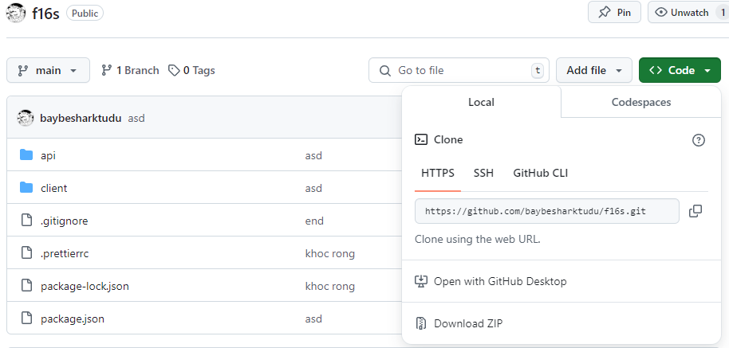

### Download zip như ảnh

### Sau khi download về thì giải nén
### Cách chạy dự án

### Back End:
### Bước 1: Open in terminal tại thư mục Chua_chinh_thuc
### Bước 2: npm i + enter
### Bước 3: npm run dev

### Front End:
### Bước 1: Open in terminal tại thư mục Chua_chinh_thuc
### Bước 2: cd client
### Bước 3: npm i + enter
### Bước 4: npm run dev

### Vào web: localhost:5173